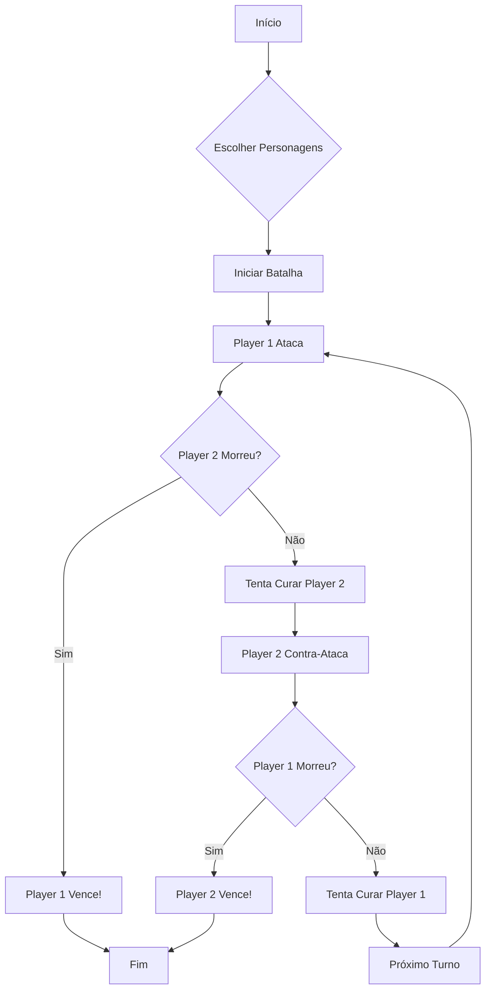

# 🎮 RPG Battle - Documentação do Projeto

## 📋 Índice
1. [Sobre](#sobre)
2. [Como Jogar](#como-jogar)
3. [Personagens](#personagens)
4. [Arquitetura](#arquitetura)
5. [Estrutura do Projeto](#estrutura)
6. [Tecnologias](#tecnologias)
7. [Como Executar](#como-executar)

---

## 📖 Sobre {#sobre}

**RPG Battle** é um jogo de batalha em turnos interativo desenvolvido com **TypeScript**. O jogo permite que dois jogadores escolham personagens únicos (Cavaleiro, Mago ou Arqueiro) e participem de uma batalha estratégica em tempo real.

### Objetivo Principal
Reduzir a vida do oponente a zero enquanto gerencia seus pontos de vida, utiliza estratégias de ataque e aproveita o sistema de cura para vencer a batalha.

---

## 🎮 Como Jogar {#como-jogar}

### Passo a Passo
1. **Escolha seu Personagem**: Selecione entre Cavaleiro, Mago ou Arqueiro
2. **Conheça seus Ataques**: Cada personagem tem até 4 tipos de ataques diferentes
3. **Estratégia**: Planeje seus movimentos considerando vida, defesa e oportunidades de cura
4. **Turnos Alternados**: Os personagens atacam alternadamente até a batalha terminar
5. **Vitória**: O último personagem com vida acima de 0 é o campeão!

### Mecânicas Principais
- **Vida**: Cada personagem começa com 100 HP
- **Ataque**: Sorteado aleatoriamente entre 4 tipos diferentes
- **Defesa**: Reduz o dano recebido em 10%
- **Cura**: Disponível uma única vez, quando HP ≤ 50%

---

## ⚔️ Personagens {#personagens}

### 🛡️ CAVALEIRO
**Especificações:**
- Força Base: 25
- Vida Máxima: 100
- Cura: 20 pontos
- Defesa: 10%

**Ataques:**
| Tipo | Dano |
|------|------|
| Ataque 1 | Base + 20 |
| Ataque 2 | Base + 20 |
| Ataque 3 | Base + 30 |
| Ataque 4 (Crítico) | Base + 40 |

---

### 🧙 MAGO
**Especificações:**
- Força Base: 25
- Vida Máxima: 100
- Cura: 20 pontos
- Defesa: 10%

**Ataques:**
| Tipo | Dano |
|------|------|
| Ataque 1 | Base + 20 |
| Ataque 2 | Base + 20 |
| Ataque 3 | Base + 30 |
| Ataque 4 (Raio) | Base + 35 |

---

### 🏹 ARQUEIRO
**Especificações:**
- Força Base: 25
- Vida Máxima: 100
- Cura: 20 pontos
- Defesa: 10%

**Ataques:**
| Tipo | Dano |
|------|------|
| Ataque 1 | Base + 20 |
| Ataque 2 | Base + 20 |
| Ataque 3 | Base + 30 |
| Ataque 4 (Flecha) | Base + 35 |

---

## 🏗️ Arquitetura {#arquitetura}

### Hierarquia de Classes

```
Personagem (Abstrata)
    ├── Cavaleiro
    ├── Mago
    └── Arqueiro

Jogo
    └── Gerencia a batalha
```

### Classe `Personagem` (Base Abstrata)

**Atributos:**
```typescript
- nome: string
- forca: number
- HP: number
- cura: number
- defesa: number
- imagem: string
- jaCurou: boolean
```

**Métodos Principais:**
```typescript
- isVivo(): boolean
- sofrerAtaque(dano: number): number
- gerarAtaque(): number
- usarCurar(): number
- atacar(personagem): void (abstrato)
```

### Classe `Jogo`

**Responsabilidades:**
- Iniciar e gerenciar turnos
- Alternância entre personagens
- Atualizar interface em tempo real
- Determinar vencedor
- Manter histórico de eventos (log)

**Métodos Principais:**
```typescript
- inicia(player1, player2): Promise<Personagem>
- reiniciaInterface(player1, player2): void
- tentaCurar(personagem): void
- atualizaInterface(player1, player2): void
```

---

## 🗂️ Estrutura do Projeto {#estrutura}

```
html.jogo - Copia/
├── Jogo.html                 # Interface principal
├── Jogo.css                  # Estilos visuais
├── Jogo.js                   # JavaScript compilado
├── Apresentacao.html         # Esta apresentação (NOVO!)
├── README.md                 # Documentação (NOVO!)
├── package.json              # Dependências
├── tsconfig.json             # Config TypeScript
└── src/
    ├── Personagem.ts         # Classe base abstrata
    ├── Cavaleiro.ts          # Implementação Cavaleiro
    ├── Mago.ts               # Implementação Mago
    ├── Arqueiro.ts           # Implementação Arqueiro
    ├── Jogo.ts               # Lógica da batalha
    ├── JogoIndex.ts          # Ponto de entrada
    └── img/
        └── gato.png          # Asset do Arqueiro
```

---

## 💻 Tecnologias {#tecnologias}

### Linguagens
- **TypeScript** - Linguagem principal com tipagem estática
- **HTML5** - Estrutura da página
- **CSS3** - Estilos e animações
- **JavaScript** - Compilado do TypeScript

### Conceitos OOP Implementados
✅ **Herança** - Subclasses herdam de Personagem  
✅ **Polimorfismo** - Método atacar() implementado em cada subclasse  
✅ **Encapsulamento** - Atributos privados e protegidos  
✅ **Abstração** - Classe Personagem é abstrata  
✅ **Async/Await** - Operações assíncronas para tempo real  

---

## 🚀 Como Executar {#como-executar}

### Opção 1: Arquivo HTML Direto (Recomendado)
1. Abra o arquivo `Jogo.html` em um navegador web
2. Selecione os personagens
3. Clique em "Começar Batalha"

### Opção 2: Servidor Local
```bash
# Python 3
python -m http.server 8000

# Ou Node.js
npx http-server
```
Acesse: `http://localhost:8000`

### Compilar TypeScript
```bash
# Instalar dependências (se necessário)
npm install

# Compilar todos os arquivos TypeScript
npx tsc

# Compilar com watch (recompila ao salvar)
npx tsc --watch
```

---

## 🎓 Conceitos Educacionais

Este projeto demonstra:

### Programação Orientada a Objetos
- Classes e subclasses
- Herança de comportamentos
- Implementação de métodos abstratos
- Encapsulamento de dados

### Estruturas de Controle
- Switch statements para escolher ataques
- Loops para turnos da batalha
- Condicionais para verificar vida e cura

### Manipulação de DOM
- Seleção de elementos
- Atualização dinâmica de conteúdo
- Tratamento de eventos de usuário

### Programação Assíncrona
- Promises para aguardar ações
- Async/Await para fluxo de batalha
- Timing de eventos

---

## 📊 Fluxo da Batalha



---

## 🐛 Possíveis Melhorias Futuras

- [ ] Sistema de multiplayer em rede
- [ ] Mais personagens e classes
- [ ] Sistema de inventário
- [ ] Efeitos sonoros e música
- [ ] Animações mais elaboradas
- [ ] Salvar histórico de batalhas
- [ ] Sistema de ranking
- [ ] Modos de dificuldade

---

## 👨‍💻 Autor

Desenvolvido como projeto educacional para aprender:
- Programação Orientada a Objetos
- TypeScript
- Desenvolvimento Web Interativo
- Arquitetura de Aplicações

---

## 📄 Licença

Projeto educacional - Uso livre para fins de aprendizado.

---

**Última atualização:** 13 de Maio de 2026

Para visualizar a apresentação interativa, abra o arquivo **Apresentacao.html** em seu navegador! 🎮